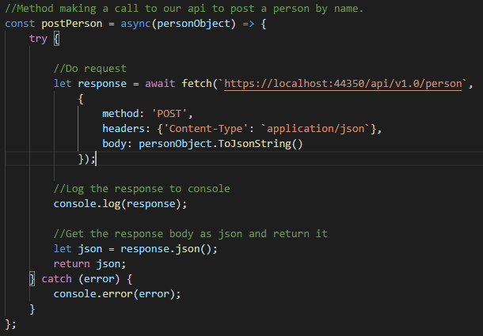

### Hur CORS är implementerat i och hur du som utvecklare kan bygga på vår lösning.

##### Översikt.

Eftersom vår frontend är skriven till stor del i JavaScript så kommer den inte kunna hämta resurser från ett annat ursprung (origin) än sitt eget. Detta beror på det som kallas "single origin principle" (SOP) som är en sedan länge implementerad standard i webbläsare av säkerhetsskäl.

För att komma runt detta och kunna prata med vårt egna API i backenden så behöver vi säga åt vår backend att tillåta delning av resurser till frontenden via det som kallas CORS (Cross Origin Resource Sharing).

För att läsa mer om CORS och alternativa sätt att tillåta det i din applikation kan du läsa i dessa artiklar:

https://docs.microsoft.com/en-us/aspnet/core/security/cors?view=aspnetcore-3.1

https://en.wikipedia.org/wiki/Cross-origin_resource_sharing

##### Backend.

Vi har valt att använda oss av lösningen att skapa en policy som vi, via attribut i kontrollerna, kan applicera på de requests som vi vill ska vara nåbara för vår frontend.

För att åstadkomma detta har vi skrivit in följande i vår startup:

- WithOrigins()
  - Här kan du bestämma vilka origins som kommer att få tillgång till API:t genom CORS.
- AllowAllMethods()
  - Metoden gör att alla CRUD-operationer får göras från den tillåtna origin:en.
  - Man kan även specificera CRUD metoder genom att istället använda WithMethods().
- AllowAllHeaders()
  - Nödvändiga för att få göra mer komplexa requests mot API:t. Som t.ex. post med json.
- I Configure: app.UseCors()
  - Det är viktigt att denna middleware laddas i rätt ordning och den måste ligga mellan "UseRouting" och "UseEndpoints".

Och för att applicera policyn på en metod i en kontroller gör man så här:

##### Frontend.

Ett första tips! Denna artikel går grundligt igenom vad CORS är och hur det fungerar på klient-sidan:

https://javascript.info/fetch-crossorigin.

Även Mozillas MDN web docs är en bra källa: https://developer.mozilla.org/en-US/docs/Web/API/Fetch_API/Using_Fetch.

Jag kan också rekommendera boken "CORS in action" av Monsur Hossain för en djupare förståelse och genomgång.

För att göra anropen med vanlig JavaScript-syntax så ser det ut som följande:

Först och främst är denna metod asynchron. Detta gör att programmet i övrigt inte stannar upp och väntar på ett anrop. 

Inuti Try-blocket görs en "fetch" som tar URL till den metod i API:t vi vill anropa samt några inställningar: 

- method: 
  - Specificerar för servern vilken typ av request som vill genomnföras.
- headers:
  - Här finns en dröser med inställningar men för vårt syfte är det "Content-Type" som är viktig. Den specificerar av vilken typ den medsända data är så att API:t kan tolka det på sin sida.
  - Just "application/json" räknas inte in i det som betecknas "simple-cors-requests" och därför får man ett CORS-error om man försöker göra detta utan att ha tillåtit alla headers på backend/server/api sidan. 
  - De tre typer som är tillåtna inom ramarna för simple request är:
    - application/x-www-form-urlencoded
    - multipart/form-data
    - text/plain
- body: 
  - Här lagrar vi själva datan vi vill skicka med i requestet. Det är viktigt att datan är av samma typ som angivits i "Content-Type".

Till sist, om fetchen går felfritt, så loggas responsmeddelandet och responsens data hämtas ut i json-format och returneras.

Sist finns även en Catch som hanterar eventuella fel som kan uppstå utan att applicationen krashar.

