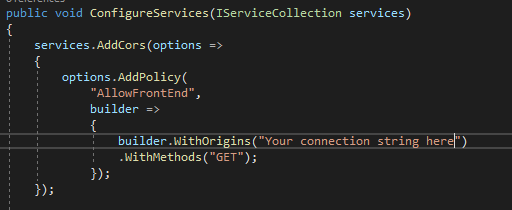
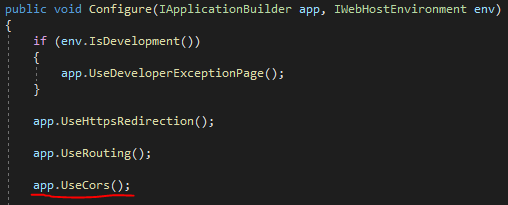
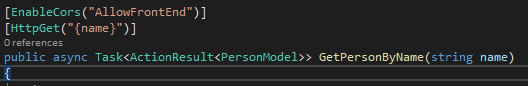

### Hur CORS är implementerat och hur du som utvecklare kan bygga på vår lösning.

##### Översikt.

Eftersom vår frontend är skriven till stor del i JavaScript så kommer den inte kunna hämta resurser från ett annat ursprung (origin) än sitt eget. Detta beror på det som kallas "single origin principle" (SOP) som är en sedan länge implementerad standard i webbläsare av säkerhetsskäl.

För att komma runt detta och kunna prata med vårt egna API i backenden så behöver vi säga åt vår backend att tillåta delning av resurser till frontenden via det som kallas CORS (Cross Origin Resource Sharing).

För att läsa mer om CORS och alternativa sätt att tillåta det i din applikation kan du läsa i dessa artiklar:

https://docs.microsoft.com/en-us/aspnet/core/security/cors?view=aspnetcore-3.1

https://en.wikipedia.org/wiki/Cross-origin_resource_sharing

##### Vår implementation.

Vi har valt att använda oss av lösningen att skapa en policy som vi, via attribut i kontrollerna, kan applicera på de requests som vi vill ska vara nåbara för vår frontend.

För att åstadkomma detta har vi skrivit in följande i vår startup:

Det är här viktigt att tänka på den metod som kedjas på som heter "WithMethods()". Här specificeras vilken typ av requests som tillåts i policyn.

Och för att applicera policyn på en metod i en kontroller gör man så här:

